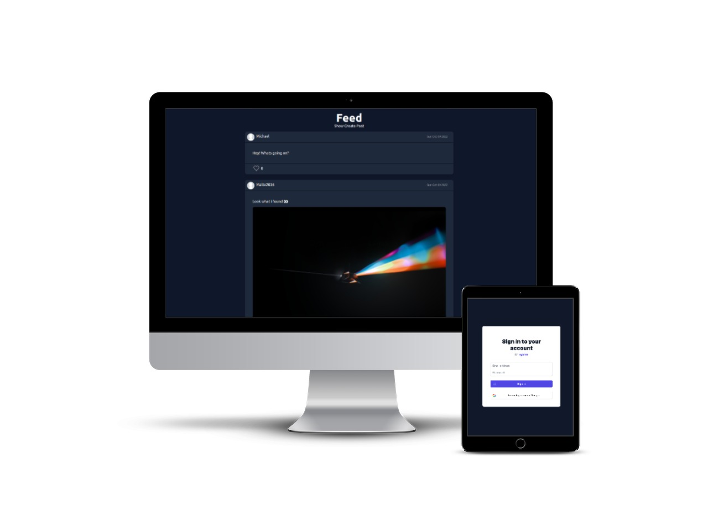

<h1 align="center">:muscle: React Social</h1>

<div align="center">
    
</div>

<p align="center">Frontend for <a href="https://github.com/Malte2036/react-social-backend">react-social-backend</a>.</p>

## :zap: Pages

:dart: **Home** (Social Posts)

:dart: **Login** (Login, Register)

:dart: **Profile**

:dart: **Settings** (Darkmode)


## 🚀 How to use

### Installation

```bash
$ npm install
```

### Running the app

```bash
# development
$ npm run dev

# production
$ npm run start
```
Open [http://localhost:3000](http://localhost:3000) to view it in the browser.

### deploy with Docker

```bash
# build image
docker build -t react-social .

# deploy
docker run -p 3000:3000 react-social
```

## :technologist: Technologies used

* [Next.js](https://nextjs.org/)
* [Tailwind CSS](https://tailwindcss.com/)
